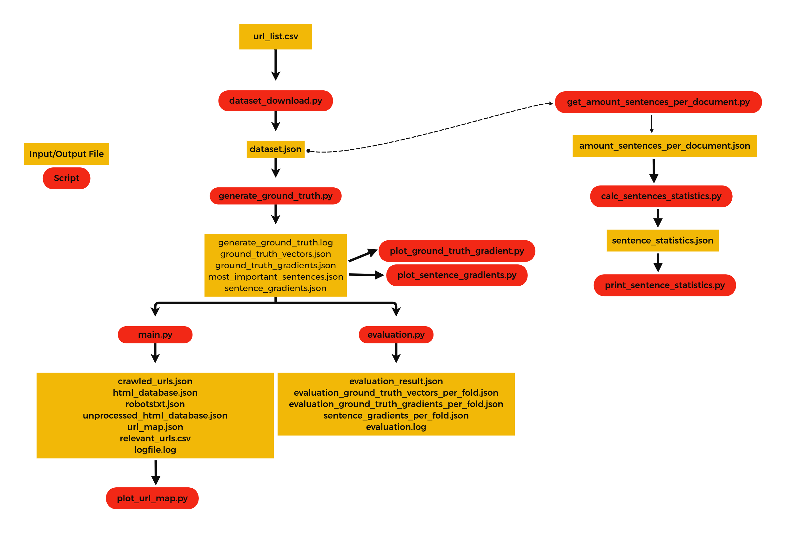
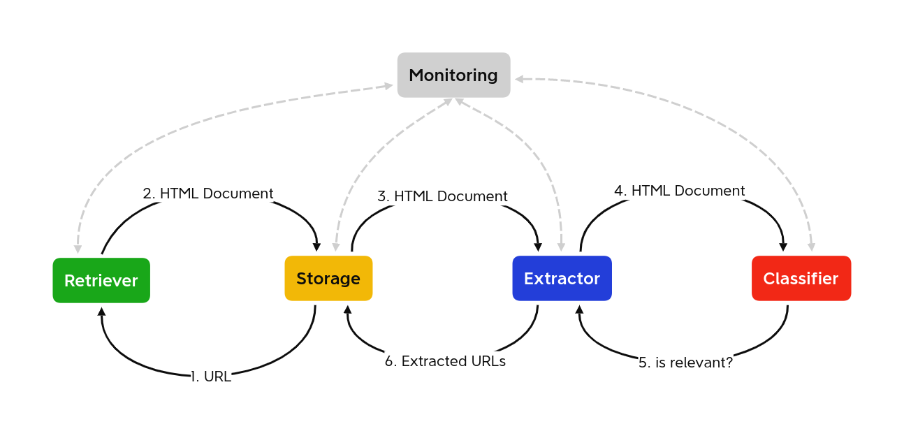

# ThreatCrawl: A BERT-based Focused Crawler for the Cybersecurity Domain

This repository hosts the code used in the paper _ThreatCrawl: A BERT-based Focused Crawler for the Cybersecurity Domain_ [1], which was originally a master's thesis by Mike Schmidt.

[1]: Kuehn, P., Schmidt, M., Bayer, M., & Reuter, C. (2023). ThreatCrawl: A BERT-based Focused Crawler for the Cybersecurity Domain (arXiv:2304.11960). arXiv. https://doi.org/10.48550/arXiv.2304.11960

## Quickstart

### Requirements

This project uses Python 3.11.
All requirement can be installed in your environment using

```
pip install -r requirements.txt
```

### Using ThreatCrawl pre-configured

ThreatCrawl comes pre-configured with a seed file, a blacklist, and a ground truth file.
To run the crawler, simply execute

```
python main.py
```

### Customizing ThreaCrawl

#### Changing Configurations

The configuration file [config.py](src/crawler_bot/config.py "config.py") contains all configurations for the crawler, including the path to a seed file.

The default configuration is

```
DEFAULT_CRAWL_DELAY = 0.5
NUM_RETRIEVER_THREADS = 1
NUM_EXTRACTOR_THREADS = 1
CUSTOM_USER_AGENT = "https://peasec.de/peasec-crawlbot/"
CRAWLING_LIMIT = 100
DIAGRAMM_MAX_URL_LENGTH = 30
GROUND_TRUTH_VECTORS_FILE = "assets/20221207_223612_ground_truth_vectors.json"
SEED_FILE = "assets/20221204_233927_seed.csv"
```

#### Customizing the Blacklist

A blacklist is used to exclude certain domains, like youtube.com, from the crawling process.
The blacklist is defined in [blacklist.json](assets/blacklist.json "blacklist.json").

#### Customizing the Ground Truth Vectors

An overview over all scripts and what files they produce/use can be seen here:


To create a custom ground truth file, [dataset_download.py](src/dataset_download.py "dataset_download.py") and [generate_ground_truth.py](src/generate_ground_truth.py "generate_ground_truth.py") need to be executed.

All input files are hard-coded and need to be changed in the according python files.

## Architecture

The basic architecture and how the modules work with each other can be seen here:


## Documentation

A detailed documentation of all files can be found here:
[Documentation](doc/ "Documentation")

## Citing

If you make use of ThreatCrawl in your work, please cite the following paper:

```
@misc{kuehn2023threatcrawl,
      title={ThreatCrawl: A BERT-based Focused Crawler for the Cybersecurity Domain},
      author={Philipp Kuehn and Mike Schmidt and Markus Bayer and Christian Reuter},
      year={2023},
      eprint={2304.11960},
      archivePrefix={arXiv},
      primaryClass={cs.CR}
}
```

## Contributors

- Philipp Kühn
- Mike Schmidt
- Markus Bayer
- Christian Reuter

## Acknowledgements

This work was supported by the German Federal Ministry for Education and Research (BMBF) in the project CYWARN (13N15407) and German Federal Ministry of Education and Research and the Hessian Ministry of Higher Education, Research, Science and the Arts within their joint support of the National Research Center for Applied Cybersecurity ATHENE.

## License

MIT License

Copyright (c) 2023 Philipp Kühn

Permission is hereby granted, free of charge, to any person obtaining a copy
of this software and associated documentation files (the "Software"), to deal
in the Software without restriction, including without limitation the rights
to use, copy, modify, merge, publish, distribute, sublicense, and/or sell
copies of the Software, and to permit persons to whom the Software is
furnished to do so, subject to the following conditions:

The above copyright notice and this permission notice shall be included in all
copies or substantial portions of the Software.

THE SOFTWARE IS PROVIDED "AS IS", WITHOUT WARRANTY OF ANY KIND, EXPRESS OR
IMPLIED, INCLUDING BUT NOT LIMITED TO THE WARRANTIES OF MERCHANTABILITY,
FITNESS FOR A PARTICULAR PURPOSE AND NONINFRINGEMENT. IN NO EVENT SHALL THE
AUTHORS OR COPYRIGHT HOLDERS BE LIABLE FOR ANY CLAIM, DAMAGES OR OTHER
LIABILITY, WHETHER IN AN ACTION OF CONTRACT, TORT OR OTHERWISE, ARISING FROM,
OUT OF OR IN CONNECTION WITH THE SOFTWARE OR THE USE OR OTHER DEALINGS IN THE
SOFTWARE.
